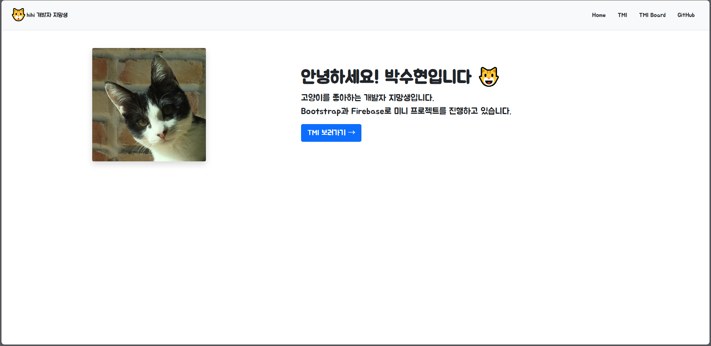
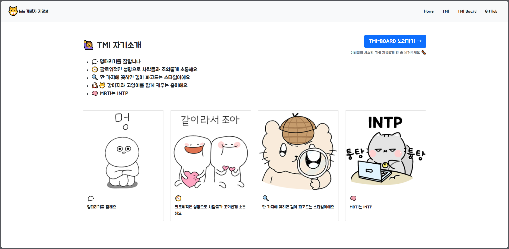
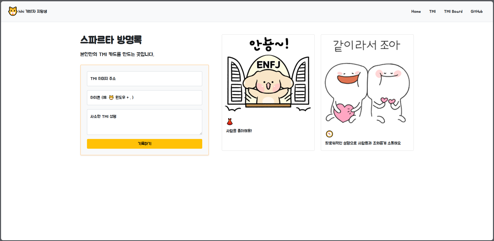

 
# 🐱 TMI 자기소개 페이지

개발자 지망생의 자기소개와 TMI를 공유하는 미니 프로젝트입니다.  
Firebase와 Bootstrap을 활용하여 정적 소개 + 동적 TMI 게시판 기능을 구현했습니다.

---

## 📌 프로젝트 개요

- **목표**: 간단한 소개 페이지를 구성하고, Firebase를 통해 사용자 TMI를 저장하고 출력하는 기능 구현
- **기술 스택**:  
  `HTML`, `CSS`, `Bootstrap 5`, `JavaScript`, `Firebase (Firestore)`

---

## ✨ 주요 기능

| 기능          | 설명                                            |
| ----------- | --------------------------------------------- |
| Firebase 연동 | 입력된 데이터를 Firestore에 저장하고, 실시간으로 불러와 카드 형태로 출력 |
| 사용자 입력 처리   | 이미지, 아이콘, 설명을 입력받아 카드 생성에 활용                  |
| 동적 렌더링      | JavaScript로 반복되는 카드 UI를 동적으로 생성 및 출력          |

---

## 📂 프로젝트 구조

├── index.html
├── tmi.html
├── tmi_board.html
├── images/                  # 화면 미리보기 및 카드용 이미지 저장
│   ├── main-page.png
│   ├── tmi.png
│   └── tmi-board.png

---

## 🔧 기능 상세

### ✅ TMI 카드 작성
- 이미지 링크, 아이콘(이모지), 설명 입력 가능
- "기록하기" 버튼 클릭 시 Firebase Firestore에 저장

### ✅ 실시간 카드 출력
- 저장된 데이터를 불러와 카드 형태로 렌더링
- 반복되는 카드 UI는 JavaScript에서 동적으로 생성

---

## 📸 페이지 미리보기

| 메인 화면 | TMI | TMI방명록 |
|-----------|---------|-----------|
|  |  |  |

TMI 페이지는 자기소개 내용을 카드로 시각화하고,  
TMI 방명록은 사용자들이 직접 카드를 등록하는 기능입니다.

👉 [TMI 게시판 동작 시연 영상 보기](https://youtu.be/fHPCBWIu3lo)

---

## 🔥 트러블슈팅 & 협업 고려사항

### 1. 자동 정렬 및 들여쓰기 이슈
- 커밋 시 불필요한 변경(들여쓰기, 줄바꿈 등)이 포함되어 전체 파일이 변경됨
- 협업 시 코드 리뷰/충돌에 큰 영향을 줄 수 있음

**💡 해결 방안**  
- 코드 포맷 통일 (`Prettier`, `.editorconfig` 등 도입 고려)  
- 커밋 전에 꼭 변경사항 확인 (`git diff` 또는 VSCode)

### 2. 기능 개발 중 커밋 관리
- 혼자 개발하다 보니 커밋 단위가 커지거나 파일이 자주 바뀜
- 협업 시 작업 단위를 더 쪼개야 함 (기능 단위, 레이아웃 단위 등)

---

## 🗂️ 향후 계획

- [ ] 입력값 유효성 검사 추가
- [ ] 게시물 수정 및 삭제 기능 구현
- [ ] 디자인 개선 (버튼 색상, 반응형 등)
- [ ] Firebase Storage 연동하여 이미지 직접 업로드 기능 추가 고려

---

## 🙋‍♀️ 개발자

**박수현 (soo59599)**  
[GitHub 프로필](https://github.com/soo59599)

---

